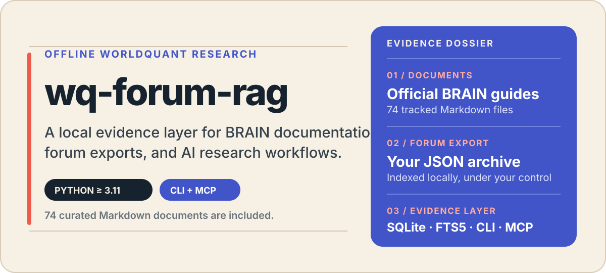

# wq-forum-rag

<p align="center">
  
</p>

<p align="center">
  <strong>面向 WorldQuant BRAIN 研究的本地检索与证据知识层。</strong><br>
  把官方 Markdown 文档、你的论坛导出和可复用知识页放入同一份 SQLite；通过 CLI 或 MCP 让 Agent 先找到证据，再组织答案。
</p>

<p align="center">
  <code>Python 3.11+</code> · <code>SQLite / FTS5</code> · <code>CLI + MCP</code> · 可选 <code>fastembed</code>
</p>

> **给 AI Agent 的入口：** 若希望 Claude Code、Codex、Gemini CLI 等直接操作本项目，请优先提供 [`README_AGENT.md`](README_AGENT.md)。

## 为什么使用它？

- **离线、轻量、可增量更新。** 不依赖外部检索服务；索引、全文检索、精确查找和 embedding cache 都落在本地 SQLite。
- **两类来源各自独立。** 仓库自带的 BRAIN 官方文档与用户自己的论坛 JSON 共享存储文件，但在表、FTS 类型与 MCP 查询入口上彼此隔离，避免混淆来源。
- **让检索结果可以沉淀。** Agent 可把有论坛原帖支撑的稳定结论保存成知识页，建立来源绑定、关系图与可导出的 Markdown Wiki，而不是每次从 chunk 临时拼接答案。

## 从零开始：得到第一个结果

### 1. 安装并建立官方文档索引

```bash
git clone <repo-url>
cd wq-forum-rag
uv sync

# 项目要求 Python >= 3.11；没有合适版本时先执行：
# uv python install 3.11

# 必跑：将仓库内 74 篇官方 Markdown 文档写入默认 SQLite 索引
uv run wq-forum-rag ingest-docs Documents
```

### 2. 搜索一条官方文档

```bash
uv run wq-forum-rag search-docs "neutralization" --top-k 3
```

本仓库的本地索引中，这个查询会命中 `Risk Neutralization Default setting`、`Double Neutralization` 和 `Neutralization` 等文档。也可以查看完整内容：

```bash
uv run wq-forum-rag show-doc neutralization
```

### 3. （可选）接入你自己的论坛导出

```bash
uv run wq-forum-rag refresh /path/to/WQPCommunityState_YYYYMMDD_HHMMSS.json
```

完成后，同一 SQLite 文件中同时有官方文档和论坛帖；可使用 `search` / `show` 搜索论坛，也可供 MCP 工具使用。

```bash
uv run wq-forum-rag search "alpha decay neutralization" --top-k 5
uv run wq-forum-rag show 12913566170391
```

如需更强的本地语义召回，可安装可选依赖：

```bash
uv sync --extra local-embeddings
```

## 数据、分发与边界

| 内容 | 是否随仓库提供 | 用途与获取方式 |
| --- | --- | --- |
| 代码、测试、`pyproject.toml` | ✅ | `git clone` 即可获得。 |
| [`Documents/`](Documents/) 中 74 篇 BRAIN 官方 Markdown 文档 | ✅ | `git clone` 后执行 `ingest-docs Documents`。 |
| 论坛 SQLite（例如 `.cache/forum.sqlite3`） | ❌ | 由每位用户使用自己的 WQ 帐号导出 JSON 后，在本地运行 `refresh` / `index` 建立。 |

最小交付物是：**本仓库源码 + 用户自己的论坛 JSON**。`Documents/` 对所有 clone 用户开箱即用。

如果你选择私下共享已经构建好的 SQLite，对方可以跳过论坛离线索引，只需将 `WQ_FORUM_RAG_DB` 指向该文件。请先自行评估 WorldQuant 平台条款及数据分享风险；该数据库默认不应提交到 Git。

## 检索工作流

```text
官方 Documents/ ─┐
                  ├─> SQLite tables + FTS5 candidates ─> hybrid rerank ─> CLI / MCP
个人论坛 JSON ───┘                                                │
                                                                   └─> 可追溯知识页与 Markdown Wiki
```

- **论坛索引：** 解析 community、topic、author、时间、投票/评论等轻量元数据，并从 HTML 清洗正文文本。
- **增量更新：** `index` 会根据源 JSON 的路径、mtime 与 size 跳过未变更文件；替换导出或需要强制刷新时使用 `--rebuild`。`refresh` 则把论坛索引和来源 manifest 提交组合为一步。
- **混合检索：** SQLite FTS5 先做关键词候选召回，再复用 `ForumSearcher` 做 lexical + dense rerank；可选 embedding 后端的结果会按 backend 与内容 hash 缓存。
- **精确/近邻查询：** `find_by_exact` 面向 topic id、URL、标题、正文、评论与 chunk 的精确词命中；`related_posts` 基于标题寻找同社区相关主题。

首次显式重建论坛索引：

```bash
uv run wq-forum-rag index \
  --json /path/to/WQPCommunityState_YYYYMMDD_HHMMSS.json \
  --db .cache/forum.sqlite3 \
  --rebuild
```

后续对同一来源的增量索引：

```bash
uv run wq-forum-rag index \
  --json /path/to/WQPCommunityState_YYYYMMDD_HHMMSS.json \
  --db .cache/forum.sqlite3
```

## CLI 速查

| 目的 | 命令 |
| --- | --- |
| 查看所有命令 | `uv run wq-forum-rag --help` |
| 搜索 / 查看论坛 | `search "query"` · `show TOPIC_ID` |
| 搜索 / 查看官方文档 | `search-docs "query"` · `show-doc SLUG` |
| 文档入库 | `ingest-docs Documents` |
| 重建 FTS5 索引 | `search-reindex` |
| 查看论坛来源差异 | `source-status ./notes` · `source-ingest-plan ./notes --commit` |
| 使用知识层 | `evolve-context`、`knowledge-search`、`knowledge-show`、`knowledge-lint`、`knowledge-graph`、`knowledge-export` |

所有命令均可通过 `--db .cache/forum.sqlite3` 指定索引文件；默认路径也是 `.cache/forum.sqlite3`。

### 官方文档源

`ingest-docs` 是增量操作：相同内容按 `content_hash` 跳过，默认会 prune 数据库中目录已不存在的文档。

```bash
uv run wq-forum-rag ingest-docs Documents
# 可选：
#   --rebuild       强制全清重建
#   --no-prune      保留 DB 中已不存在于目录的文档
```

文档与论坛在设计上完全隔离：

- 文档表：`documents` / `doc_chunks`，FTS kind 为 `doc_chunk`
- 论坛表：`topics` / `chunks`，FTS kind 为 `forum_chunk`
- MCP 中 `search_docs` 只命中文档，`search_forum` 只命中论坛
- 两者共享 SQLite 文件与 embedding cache，但不互相污染

## MCP：让 Agent 使用本地证据

服务端默认从 `WQ_FORUM_RAG_DB` 获取索引路径，也可在每次工具调用时传入 `db`。

```bash
export WQ_FORUM_RAG_DB=/absolute/path/.cache/forum.sqlite3
uv run wq-forum-rag-mcp
```

Claude Desktop 或其他兼容 MCP 客户端的配置示例：

```json
{
  "mcpServers": {
    "wq-forum-rag": {
      "command": "uv",
      "args": [
        "--directory",
        "/absolute/path/wq-forum-rag",
        "run",
        "wq-forum-rag-mcp"
      ],
      "env": {
        "WQ_FORUM_RAG_DB": "/absolute/path/.cache/forum.sqlite3"
      }
    }
  }
}
```

<details>
<summary><strong>查看全部 19 个 MCP 工具</strong></summary>

| 分组 | 工具 |
| --- | --- |
| 论坛检索 | `search_forum(query, db=None, top_k=5)`<br>`get_post(topic_id, db=None)`<br>`find_by_exact(value, db=None, community=None, top_k=5)`<br>`related_posts(topic_id, db=None, top_k=5)` |
| 官方文档 | `search_docs(query, db=None, top_k=5)`<br>`get_doc(slug, db=None)`<br>`ingest_docs(directory, db=None, rebuild=False, prune=True)` |
| 来源管理 | `source_status(source, db=None)`<br>`source_ingest_plan(source, db=None, commit=False)` |
| 知识层 | `build_evolution_context(query, db=None, top_k=5)`<br>`propose_knowledge_page(slug, title, summary, body, source_topic_ids, confidence, db=None, links=None, auto_publish=True)`<br>`search_knowledge(query, db=None, top_k=5, include_drafts=False)`<br>`get_knowledge_page(slug, db=None)`<br>`link_knowledge_pages(source_slug, target_slug, relation_type, db=None, weight=1.0, confidence=0.8)`<br>`lint_knowledge(db=None, slug=None)`<br>`publish_knowledge_page(slug, db=None)`<br>`graph_query(slug, db=None, depth=1, relation_type=None)`<br>`export_knowledge_wiki(db=None, output_dir=".cache/wiki", include_drafts=False)` |
| 维护 | `rebuild_search_index(db=None)` |

</details>

## 自进化知识层：从证据到可复用结论

知识层不内置外部 LLM API：**MCP 客户端负责阅读、总结和判断；本项目负责确定性存储、来源校验、低风险自动发布、图谱连边和 lint。**

推荐让 Agent 按以下流程工作：

1. `build_evolution_context("你的问题")`：优先返回已发布知识页，并附带完整论坛证据。
2. Agent 阅读上下文，归纳稳定结论。
3. `propose_knowledge_page(...)`：写入草稿，并提供支撑结论的 `source_topic_ids`。
4. 当 `confidence >= 0.85`、来源 topic 存在、且没有 `conflicts_with` 阻塞项时，系统允许低风险自动发布；否则可经 `lint_knowledge` / `publish_knowledge_page` 处理。
5. 后续用 `search_knowledge(...)` 查找已沉淀内容，必要时再回退到论坛检索。

知识页仍写入同一 SQLite，相关表包括：

- `knowledge_pages`：概念、规则、经验等页面
- `knowledge_sources`：知识页与论坛原帖的来源绑定
- `knowledge_links`：typed edges / backlink
- `knowledge_events`：append-only 演化日志

本地检查与导出示例：

```bash
uv run wq-forum-rag evolve-context "alpha decay neutralization" --top-k 3
uv run wq-forum-rag knowledge-search "neutralization" --json
uv run wq-forum-rag knowledge-show alpha/neutralization-decay
uv run wq-forum-rag knowledge-lint
uv run wq-forum-rag knowledge-graph alpha/neutralization-decay --depth 2
uv run wq-forum-rag knowledge-export --out .cache/wiki
```

## 维护已有安装

拉取新代码后，以下步骤是幂等的：

```bash
cd /path/to/wq-forum-rag
git pull
uv run wq-forum-rag ingest-docs Documents
```

通常**不需要**：

- `uv sync`：确认本次升级没有新增或变更依赖时不必执行。
- `pip install -e .`：`uv run` 已基于当前源码运行。
- 删除、迁移或重建既有 `forum.sqlite3`：文档相关表以 additive 方式创建，不影响已有论坛数据。
- 重跑 `refresh`：仅升级官方文档能力时，论坛索引不受影响。

然后重启 MCP 客户端（Claude Desktop、Claude Code、Cursor 等）；MCP server 是常驻进程，启动时加载代码，不会热重载。重启后可验证：

```bash
uv run wq-forum-rag ingest-docs Documents
# 预期：indexed_documents=74，且 doc_chunks 为非零
```

再从 MCP 客户端调用 `search_docs("neutralization")` 或 `get_doc("operators")`。若新工具仍不可见，优先检查客户端是否已重启，其次检查 `command` / `args` 是否指向正确的仓库目录。

## 当前范围与后续方向

已实现：本地 JSON 解析、SQLite 原帖与 chunk 索引、Markdown 文档摄入、FTS5 + hybrid search、来源 manifest、知识页与来源绑定、typed graph、Wiki 导出、backlink boost 与 embedding cache。

暂未实现：PDF/截图/音频/视频等多模态摄入、定时或 always-on ingestion、由 LLM 自动识别矛盾（目前由客户端通过 `conflicts_with` 提交后阻止自动发布），以及外部向量数据库或 seekdb 类服务化基础设施。

对外 CLI / MCP contract 与内部 `parser`、`storage`、`search` 模块解耦；后续替换 embedding backend 或调优 chunk/search 策略，不应改变既有 CLI/MCP 接口。
